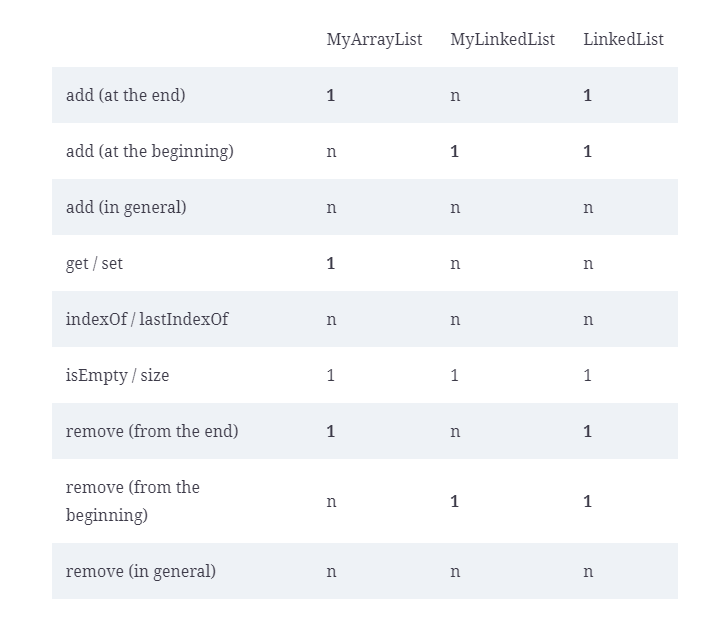
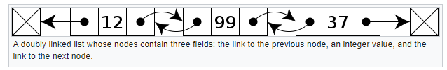

# Analise de Algoritmos

As vezes, precisamos deicidir qual algoritmo é melhor para uma aplicação em particular (exemplo: devemos usar ArrayList ou LinkedList como implementação de uma lista ?), e uma abordagem é tentar implementar ambos e comparar o tempo de execução. Essa abrodagem é chamada ***profiling***.

Essa abordagem não é a mais recomendada para analisar um algoritmo pois dependende de varios fatores tais como: hardware em que aquele algoritmo será executado, o tamanho do input que será utilizado para o teste daquele algoritmo e etc...

É possível realizar essa analize dos algoritmos sem ter que implementa-los, porém precisamos levar em consideração alguns pontos, tais como:

- Para evitar lidar com os detalhes do hardware do computador, geralmente identificamos as operações básicas que compõem um algoritmo – como adição, multiplicação e comparação de números – e contamos o número de operações que cada algoritmo requer.
- Para evitar lidar com os detalhes dos inputs, a melhor opção é analisar o desempenho médio dos inputs que esperamos. Se isso não for possível, uma alternativa comum é analisar o pior cenário.
- Finalmente, temos que lidar com a possibilidade de que um algoritmo funcione melhor para problemas pequenos e outro para grandes. Nesse caso, geralmente nos concentramos nos grandes, porque para problemas pequenos a diferença provavelmente não importa, mas para problemas grandes a diferença pode ser enorme.

A maioria dos algoritmos simples se enquadra em apenas algumas categorias:

- Constant Time: Um algoritmo é de tempo constante se o tempo de execução não depende do tamanho do input. Por exemplo, se você tiver uma matriz de n elementos e usar o operador colchete ([]) para acessar um dos elementos, essa operação terá o mesmo número de operações, independentemente do tamanho da matriz.

- Linear: Um algoritmo é linear se o tempo de execução é proporcional ao tamanho do input. Por exemplo, se você somar os elementos de um array, terá que acessar n elementos e realizar n – 1 adições. O número total de operações (acessos e adições de elementos) é 2n – 1, que é proporcional a n.
  
- Quadratic: Um algoritmo é quadrático se o tempo de execução é proporcional a n2. Por exemplo, suponha que você queira verificar se algum elemento em uma lista aparece mais de uma vez. Um algoritmo simples é comparar cada elemento com todos os outros. Se houver n elementos e cada um for comparado a n – 1 outros, o número total de comparações é , que é proporcional a n2 à medida que n cresce.


## Big O Notation

Essa notação fornece uma maneira conveniente de escrever regras gerais sobre como os algoritmos se comportam quando os compomos.

- O(1) = Algoritmos de tempo constante;
- O(n) = Algoritmos de tempo linear;
- O(2n) = Algoritmos de tempo quadratico;

f E O(n) e g E O1()


***OBS:*** Quando as pessoas veem duas operações lineares dentro de um método, às vezes pensam que o resultado é quadrático, mas isso só se aplica se uma operação estiver aninhada dentro da outra. Se você invocar uma operação após a outra, os tempos de execução serão adicionados. Se ambos estiverem em O(n), a soma também estará em O(n).

## Análise amortizada 

**Descrição:** É uma forma de classificar algoritmos, calculando o tempo médio em uma série de invocações. 

 ```java
    public boolean add(E element) {
        if (size >= array.length) {
            // make a bigger array and copy over the elements
            E[] bigger = (E[]) new Object[array.length * 2];
            System.arraycopy(array, 0, bigger, 0, array.length);
            array = bigger;
        } 
        array[size] = element;
        size++;
        return true;
    }
 ```

Seguindo a regra da análise amortizada, o algoritmo acima temo tempo de execução ***constante na média*** mesmo ele as vezes executando a operação *** System.arraycopy(array, 0, bigger, 0, array.length);*** que é custosa e demorada.

A ideia-chave é que o custo extra de copiar o array seja distribuído, ou “amortizado”, por uma série de invocações.

## Comparando ArrayList com LinkedList 

A tabela abaixo compara os tipos de lista ArrayList e LinkedList usando Big O notation:



Repare que aqui temos 3 implementações, MyArrayList que é a nossa implementação simulando um ArrayList do Java, MyLinkedList que é a nossa implementação simulando a implementação de uma LinkedList do Java e LinkedList que é a implemntação do Java propriamente dita.

### Qual a diferneça entre MyLinkedList e LinkedList ?

A nossa implementação chamada MyLinkedList usa uma lista encadeada individualmente; ou seja, cada elemento contém um link para o próximo, enquanto, LinkedList do Java é uma lista duplamente ligada (DoubledLinkedList) contendo um link para o proximo elemento e para o anterior, por isso, que podemos notar adicionar e remover um elemento no final da lista é constante para LinkedList e Quadratico para MyLinkedList.

***Exemplo de uma DoubleLinkedList:***



***Para saber mais:*** https://en.wikipedia.org/wiki/Doubly_linked_list

## Como escolher uma estrutura de dados para trabalhar ?

A implementação DoubleLikedList (LinkedList do Java) é melhor do que ArrayList para adicionar e remover no início e tão boa quanto ArrayList para adicionar e remover no final. Portanto, a única vantagem de ArrayList é para get e set, que exigem tempo linear em uma LinkedList, mesmo que seja duplamente ligada.

Se você sabe que o tempo de execução de seu aplicativo depende do tempo que leva para obter (get) e definir elementos (set), um ArrayList pode ser a melhor escolha. Se o tempo de execução depende de adicionar e remover elementos perto do início ou do fim, LinkedList pode ser melhor.

Mas lembre-se de que essas recomendações são baseadas na ordem de grandeza para grandes problemas. Existem outros fatores a serem considerados:

- Se essas operações não ocuparem uma fração substancial do tempo de execução de seu aplicativo, ou seja, se seus aplicativos passarem a maior parte do tempo fazendo outras coisas, sua escolha de uma implementação de List não importará muito.
- Se as listas com as quais você está trabalhando não forem muito grandes, talvez você não obtenha o desempenho esperado. Para problemas pequenos, um algoritmo quadrático pode ser mais rápido que um algoritmo linear, ou linear pode ser mais rápido que o tempo constante. E para pequenos problemas, a diferença provavelmente não importa.
- Além disso, não se esqueça do espaço. Até agora, focamos no tempo de execução, mas diferentes implementações requerem diferentes quantidades de espaço. Em um ArrayList, os elementos são armazenados lado a lado em um único bloco de memória, portanto, há pouco espaço desperdiçado e o hardware do computador costuma ser mais rápido com blocos contíguos. Em uma lista encadeada, cada elemento requer um nó com um ou dois links. Os links ocupam espaço (às vezes mais que os dados!), e com nós espalhados na memória, o hardware pode ser menos eficiente.

Em resumo, a análise de algoritmos fornece alguma orientação para a escolha de estruturas de dados, mas somente se

- O tempo de execução do seu aplicativo é importante,
- O tempo de execução de seu aplicativo depende de sua escolha de estrutura de dados e
- O tamanho do problema é grande o suficiente para que a ordem de crescimento realmente preveja qual estrutura de dados é melhor.


### Qual a diferença entre as interfaces Iterator e Iterable ?

As interfaces Iterable e Iterator em Java fazem parte do Java Collections Framework e são usadas para percorrer uma coleção de objetos.

Aqui estão as principais diferenças:

- Interface Iterable: Esta interface permite que um objeto seja o alvo de uma declaração "for-each" (também chamada de loop "for-each"). Classes que implementam essa interface devem fornecer um método chamado iterator(). Esse método retorna um Iterator para a coleção de objetos. Basicamente, Iterable é um meio para permitir que uma coleção de objetos seja iterada.

- Interface Iterator: Um Iterator é um objeto que permite ao programador percorrer a coleção, obter ou remover elementos. A interface Iterator tem métodos como hasNext(), next(), e remove(). O método hasNext() retorna verdadeiro se ainda houver elementos para percorrer na coleção. O método next() retorna o próximo elemento da coleção. E o método remove() remove o último elemento que foi devolvido pelo Iterator da coleção.

Portanto, a diferença chave é que Iterable é uma interface que permite a uma classe ou estrutura de dados ser alvo de um loop "for-each", enquanto Iterator é uma interface que fornece a capacidade de percorrer e manipular elementos de uma coleção de objetos.

No geral, Iterable e Iterator trabalham juntos para tornar possível iterar sobre e manipular uma coleção de objetos.

Links uteis sobre o assunto:
- https://www.techiedelight.com/pt/differences-between-iterator-and-iterable-in-java/
- https://acervolima.com/java-implementando-iterator-e-interface-iterable/


