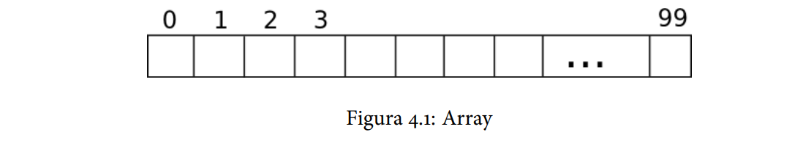

# Armazenamento Sequencial

Abaixo, segue um exemplo de armazenamento sequencial:

## Tipos de Armazenamento Sequencial

- Lista;
  - ArrayList;
  - Vector;
  - LinkedList (DoubleLinkedList);
- Pilhas;
- Fila;

## Qual a diferença entre uma ArrayList e um Vector ?

- Primeiramente vamos falar sobre o fato de Vector ser sincronizado e o ArrayList não. Significa dizer que se você possui uma aplicação 
que precisa ser thread-safe em determinado ponto, use Vector e você estará garantido.
- Outro ponto importante é a alocação dinâmica do Vector, que é diferente do ArrayList. Lembra que falamos que o ArrayList aumenta 50% 
do seu tamanho quando a lista está cheia ? O Vector aumenta o dobro, ou seja, se você tem uma lista de 10 elementos cheia, essa lista aumentará para 20, 
com 10 posições vazias. Mas isso não é ruim ? Depende do que você precisar, se você está precisando aumentar a quantidade de elementos 
com muita frequência, então o ideal é usar o Vector que aumenta o dobro e você ficará com muito mais espaço do que no ArrayList que 
precisará ficar aumentando com mais frequência, diminuindo assim a performance da sua aplicação.

fonte: https://www.devmedia.com.br/diferenca-entre-arraylist-vector-e-linkedlist-em-java/29162

## Performance entre um ArrayList / Vector e uma LinkedList 

O LinkedList implementa uma “double linked list”, ou seja, uma lista duplamente “linkada”. A sua principal diferença entre o ArrayList
é na performance entre os métodos add, remove, get e set.

Este tipo de lista possui melhor performance nos métodos add e remove, do que os métodos add e remove do ArrayList, em compensação seus métodos 
get e set possuem uma performance pior do que os do ArrayList. Vamos abaixo fazer uma comparação entre a complexidade apresentada de cada método 
do ArrayList e o da LinkedList.

- get(int index): LinkedList possui O(n) e ArrayList possui O(1)
- add(E element): LinkedList possui O(1) e ArrayList possui O(n) no pior caso, visto que o array será redimensionado e copiado para um novo array.
- add(int index, E element): LinkedList possui O(n) e ArrayList possui O(n) no pior caso
- remove(int index): LinkedList possui O(n) e ArrayList possui O(n-index), se remover o último elemento então fica O(1)

Perceba então que a principal diferença está na performance, e uma análise minuciosa deve ser feita em casos onde a performance é algo crítica e todos o pontos devem ser considerados.

fonte: https://www.devmedia.com.br/diferenca-entre-arraylist-vector-e-linkedlist-em-java/29162